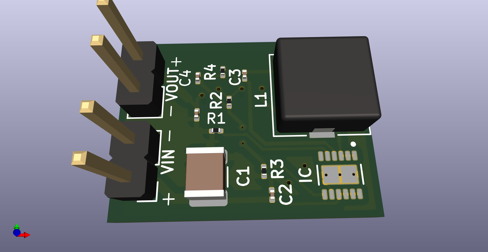
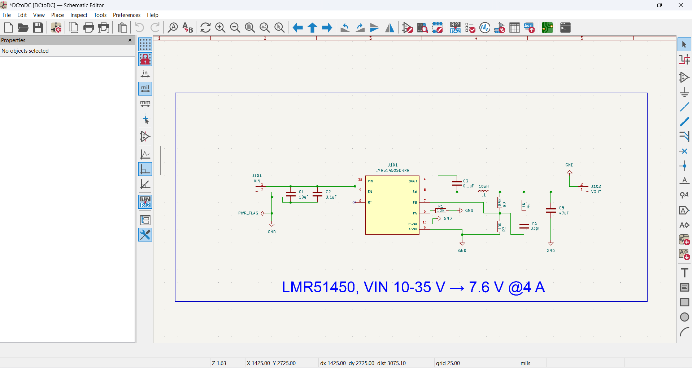

# LMR51450 DC-DC Buck Converter
DC-DC Buck Converter using TI LMR51450, input 10–35V, output 7.6V 4A. Designed in KiCad

---

## 📌 Overview
This project implements a **DC-DC Buck Converter** based on the **Texas Instruments LMR51450**.  
It is designed in **KiCad** with the following specifications:

- **Input Voltage:** 10 V – 35 V  
- **Output Voltage:** 7.6 V  
- **Output Current:** 4 A  
- **Switching Frequency:** 500 kHz (default, RT pin open)  

The design includes proper **input/output filtering**, **optimized trace widths**, and follows **PCB routing guidelines** for stable performance.

---

## 📂 Repository Structure
- `Task1_buck_converter/Schematics/` → KiCad schematic files (`.kicad_sch`, `.kicad_pro`)  
- `Task1_buck_converter/PCB/` → PCB layout file (`.kicad_pcb`)  
- `Task1_buck_converter/BOM/` → Bill of Materials (`.csv`)  
- `MEDIA/` → Snapshots of schematic & PCB (`.png`)  

---

## 📷 Design Media

### 🔹 Full Design Block Diagram


### 🔹 Complete Schematic


### 🔹 PCB Routing Layout


---

## 🛠 Tools Used
- **KiCad 7/8** → Schematic & PCB design  
- **BOM Generator** → CSV output  
- **GitHub** → Version control & project hosting  

---

## 🔧 Design Specifications
- **Input Voltage Range:** 10V – 35V DC  
- **Output Voltage:** 7.6V DC  
- **Maximum Output Current:** 4A  
- **Switching Frequency:** 500 kHz  
- **Efficiency:** >90% at full load  

---

---

## 🚀 Getting Started
Clone this repository:
```bash
git clone https://github.com/your-username/LMR51450-DC-DC-Buck-Converter.git
